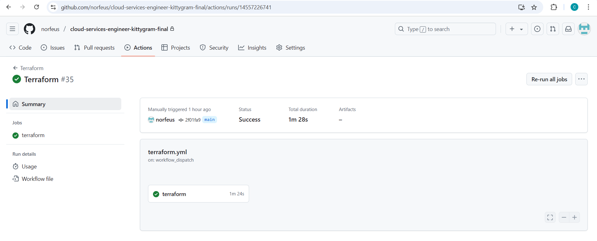
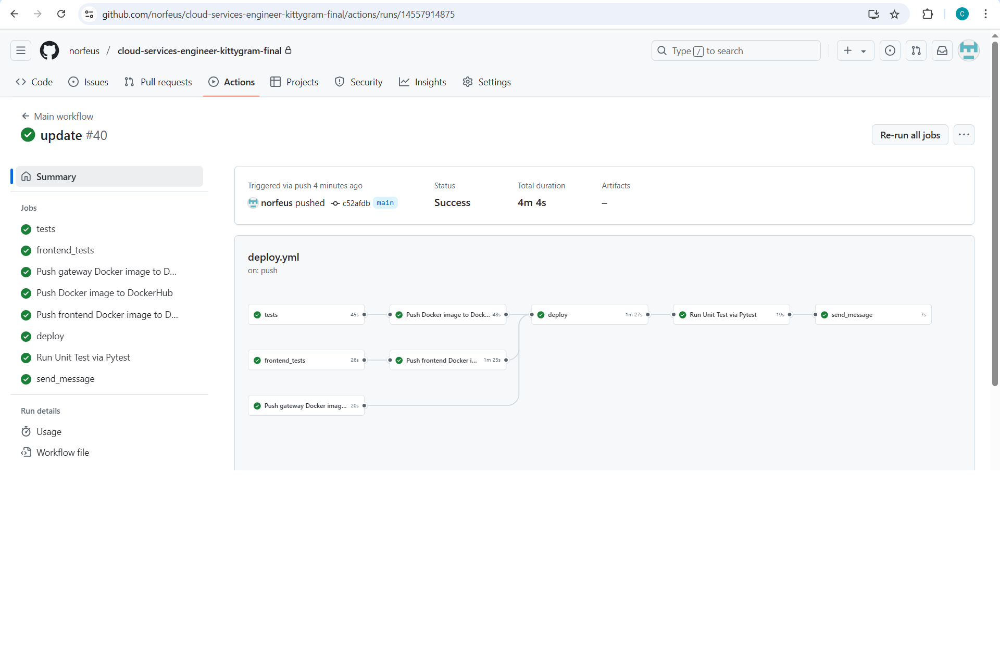
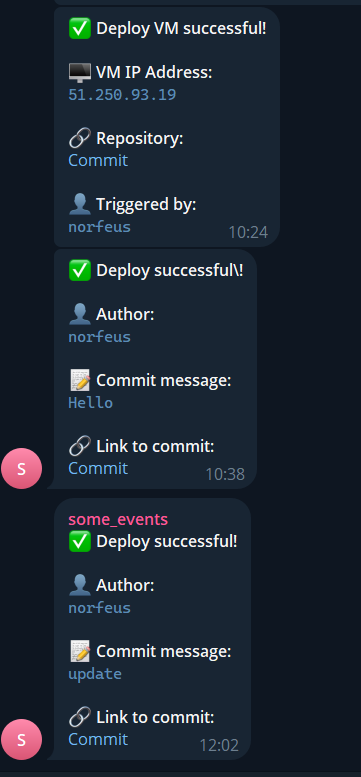
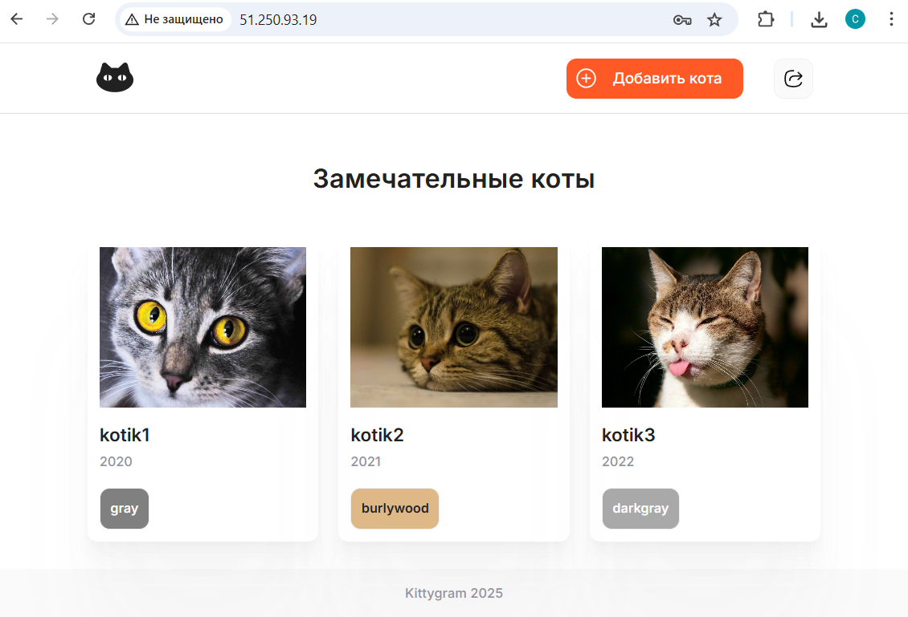

# Проект Kittygram: Автоматизация развертывания с Terraform и GitHub Actions

## Описание проекта

Kittygram — это приложение для управления данными о кошках. В рамках этого проекта вы настроите автоматизацию развертывания инфраструктуры в Яндекс Облаке с использованием Terraform и организуете CI/CD-процесс через GitHub Actions.

Цель проекта:
- Создать инфраструктуру в Яндекс Облаке с помощью Terraform.
- Настроить автоматический деплой приложения Kittygram на созданную виртуальную машину.
- Использовать GitHub Actions для выполнения тестов, сборки Docker-образов и уведомлений в Telegram.

---

## Описание переменных

В проекте используются следующие секреты и переменные окружения, которые необходимо добавить в GitHub Secrets:

| Название переменной | Описание |
|---------------------|----------|
| `ACCESS_KEY`        | Ключ доступа к API Яндекс Облака |
| `DOCKER_PASSWORD`   | Пароль от аккаунта Docker Hub |
| `DOCKER_USERNAME`   | Логин от аккаунта Docker Hub |
| `HOST`              | IP-адрес или доменное имя сервера |
| `POSTGRES_DB`       | Имя базы данных PostgreSQL |
| `POSTGRES_PASSWORD` | Пароль пользователя базы данных PostgreSQL |
| `POSTGRES_USER`     | Имя пользователя базы данных PostgreSQL |
| `SECRET_KEY`        | Секретный ключ Django |
| `SSH_KEY`           | Приватный SSH-ключ для подключения к серверу |
| `SSH_KEY_PUB`       | Публичный SSH-ключ |
| `SSH_PASSPHRASE`    | Парольная фраза для SSH-ключа (если есть) |
| `TELEGRAM_TO`       | ID чата Telegram для уведомлений |
| `TELEGRAM_TOKEN`    | Токен Telegram-бота для уведомлений |
| `USER`              | Имя пользователя для подключения к серверу |
| `YC_CLOUD_ID`       | ID облака в Яндекс Облаке |
| `YC_FOLDER_ID`      | ID каталога в Яндекс Облаке |
| `YC_KEY_JSON`       | JSON-ключ сервисного аккаунта Яндекс Облака |

---

## Демонстрация работы пайплайнов

Ниже представлены скриншоты, демонстрирующие работу пайплайнов:

1. **Успешный запуск Terraform pipeline**:
   

2. **Успешный деплой приложения**:
   

3. **Уведомление в Telegram**:
   

---
## Чек-лист проектной работы

1. **Workflow для развёртывания инфраструктуры**:
   - В репозиторий добавлен файл `.github/workflows/terraform.yml` для развёртывания инфраструктуры с помощью Terraform.

2. **Доступность проекта**:
   - Проект Kittygram доступен по ссылке, указанной в файле `tests.yml`.

3. **Автотесты**:
   - Стадия автотестов после деплоя выполняется успешно.

4. **Функциональность проекта**:
   - Функциональность проекта Kittygram соответствует описанию.

---

Вот пример пункта для `README.md`, который описывает демонстрацию работы Kittygram, включая скриншот, адрес приложения и учетные данные:

---

## Демонстрация Kittygram

Приложение успешно развернуто и доступно по следующему адресу:  
**[http://51.250.93.19/](http://51.250.93.19/)**

### Доступ к приложению:
- Вы можете зарегистрировать нового пользователя через форму регистрации.
- Либо войти под уже созданным аккаунтом администратора:
  - **Логин:** `admin`  
  - **Пароль:** `admin123!!`

### Функциональность:
На скриншоте ниже видно, что приложение работает корректно. Пользователи могут добавлять, просматривать и редактировать информацию о котах.  

  
_Пример добавленных котов в интерфейсе приложения._

---

### Как проверить:
1. Перейдите по ссылке: [http://51.250.93.19/](http://51.250.93.19/).
2. Авторизуйтесь с учетными данными администратора или зарегистрируйте нового пользователя.
3. Добавьте нового кота или просмотрите существующие записи.

---

## Дополнительные материалы

- [Документация Terraform](https://www.terraform.io/docs)
- [Документация GitHub Actions](https://docs.github.com/en/actions)

